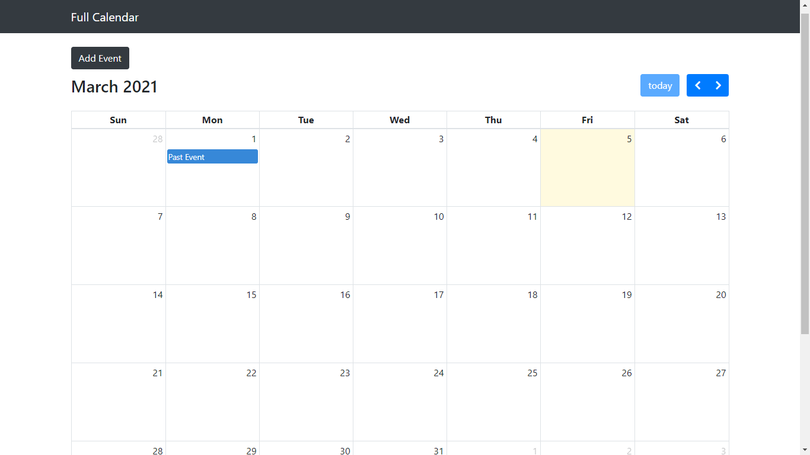
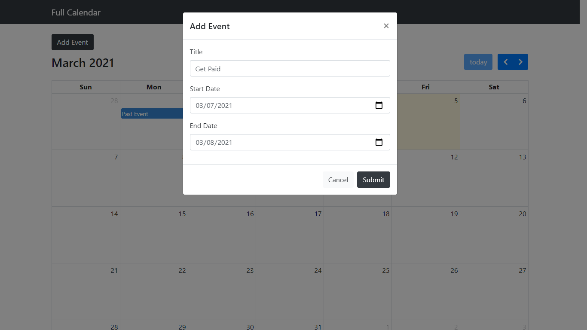
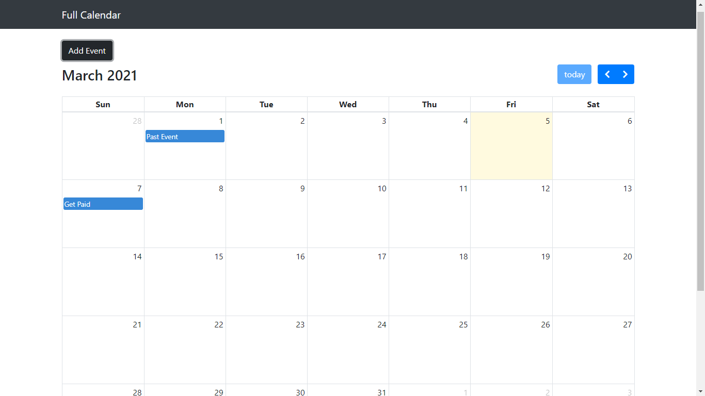
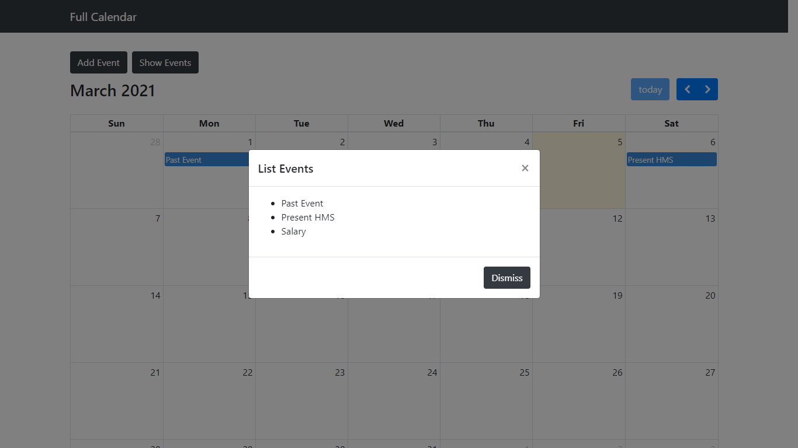

# Calendar and Events Persistence
Full Calendar JS, PHP event persistence integration

## Default

A basic calendar with a seeded event

## Adding and Event

Adding an event to the calendar using boostrap modal

## Displaying the Event

Displaying an event that has been added

## Events Dialog

Diplaying all events in a bootstrap dialog modal

